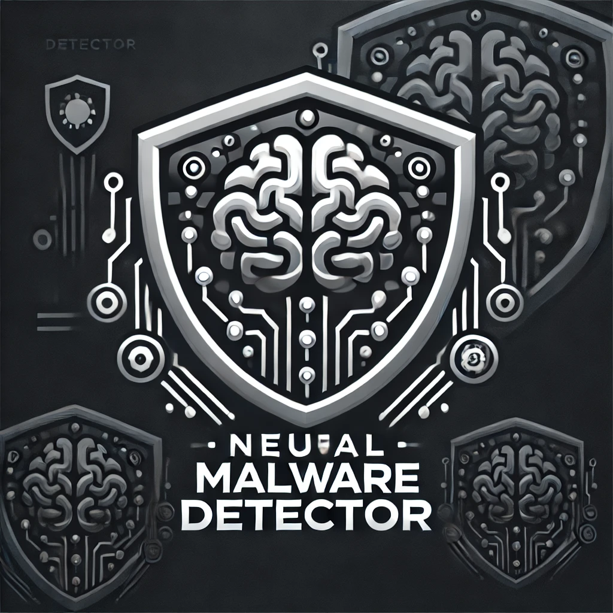

# Neural Malware Detector




## Overview

The Neural Malware Detector is a machine learning-powered application designed to detect malicious files by analyzing their string features. The project leverages a trained neural network model to classify files as either benign or malicious. The application is built using Flask and is deployed on both Azure and Google Cloud.

## Table of Contents

- [Overview](#overview)
- [Features](#features)
- [Installation](#installation)
- [Usage](#usage)
- [Model Training](#model-training)
- [Deployment](#deployment)
- [License](#license)
- [Contributing](#contributing)
- [Contact](#contact)

## Features

- **File Upload Interface**: Users can upload files through a web interface.
- **Real-time Malware Detection**: The application processes the uploaded file and predicts whether it's malicious or benign.
- **Responsive Web Design**: The UI is designed to be responsive and user-friendly, with a dark, malicious theme.
- **Deployed on Cloud**: Available on both Azure and Google Cloud for easy access and scalability.

## Installation

### Prerequisites

- Python 3.x
- Flask
- pip (Python package manager)
- Google Cloud SDK (for GCP deployment)
- Azure CLI (for Azure deployment)

### Setup

1. **Clone the repository**:
    ```bash
    git clone https://github.com/your-username/neural-malware-detector.git
    cd neural-malware-detector
    ```

2. **Create a virtual environment**:
    ```bash
    python3 -m venv venv
    source venv/bin/activate  # On Windows use `venv\Scripts\activate`
    ```

3. **Install dependencies**:
    ```bash
    pip install -r requirements.txt
    ```

4. **Download the trained model**:
    - Make sure to download the trained model file  from your Google Colab environment or any storage service and place it in the appropriate directory.

5. **Set up environment variables**:
    - Create a `.env` file in the project root and set your Flask app secret key and other environment variables as needed.

## Usage

1. **Run the application locally**:
    ```bash
    python run.py
    ```

2. **Access the application**:
    - Open your browser and go to `http://127.0.0.1:5000`.

3. **Upload a file**:
    - Use the provided interface to upload a file for malware detection.
    - View the result on the results page.

## Model Training

The model was trained using Google Colab with the following steps:

1. **Data Preparation**:
    - Collect and preprocess the dataset of malware and benign files.

2. **Feature Extraction**:
    - Extract string-based features from each file.

3. **Model Training**:
    - Train a neural network model on the extracted features using libraries such as TensorFlow or PyTorch.

4. **Model Evaluation**:
    - Evaluate the model's performance using appropriate metrics (e.g., accuracy, precision, recall).

5. **Save the Model**:
    - Save the trained model as `` for later use in the Flask application.

## Deployment

The application is deployed on both Azure and Google Cloud. Below are the steps for deployment:

### Azure

1. **Set up an Azure App Service**.
2. **Deploy the Flask application** using the Azure CLI or through the Azure portal.
3. **Configure environment variables** in the Azure portal.

### Google Cloud

1. **Set up a Google App Engine** or **Google Cloud Run** service.
2. **Deploy the Flask application** using the Google Cloud SDK.
3. **Configure environment variables** in the Google Cloud Console.

## License

This project is licensed under the [MIT License](LICENSE).

## Contributing

Contributions are welcome! Please open an issue or submit a pull request for any improvements or bug fixes.

## Contact

For any questions or feedback, please contact ashfaaqf@proton.me

### Acknowledgments

- **Flask** for the web framework.
- **Scikit-learn** for machine learning tools.
- **Docker** and **Kubernetes** for deployment orchestration.
